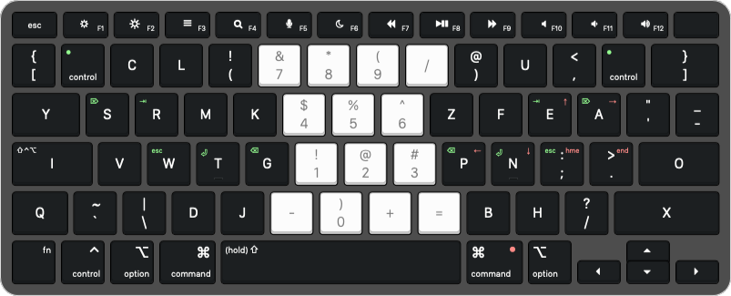
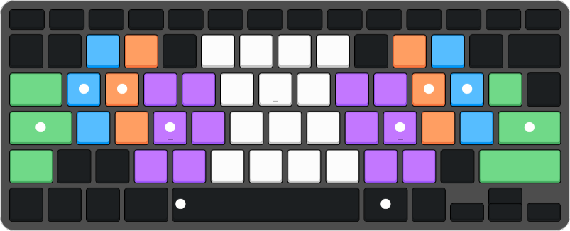
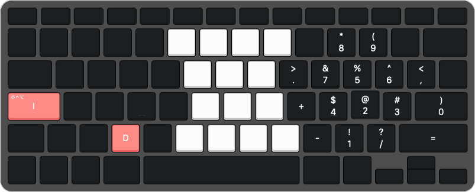

# ErgoMac

I made this so that I would'nt have to always carry my custom keyboard with me
when travelling (less things to worry about losing), but could still avoid
getting wrist pain when using my laptop.

Although tedious to configure (due to the .json file structure), this has been
very fun to set up and even more fun to use.

This repo contains the necessary code and files to replicate the below keyboard
layout on any keyboard connected to a MacOS computer with the help of
[Karabiner-Elements](https://karabiner-elements.pqrs.org).

Sadly, the complex modifications file is written in .json, it is therefore very
hard to organise and read. I've tried my best to document certain sections for
better understanding of what-does-what. If you wish to replicate the layout as
shown in the pictures follow the [Guide](##Guide).

Should you want to make your own custom layout, but would like to keep the
layers and operator settings, you'll need to first reconfigure your simple
modifications in Karabiner-Elements, and then change the "from" key values to
the ones you assingned in your custom layout.

Inspired by Darin Flynn

## Features:

- Ergonomic split layout
- Natural home row position for easier typing
- Mid-section Num-pad for quick access to numbers + Right hand Num-pad layer
- On-hold MEH-key (shtf+ctrl+alt) for launching apps and other shortcuts
- Movement layer (arrow keys) on RIGHT_COMMAND hold.
- Edit layer (delete, return, esc, etc.) on RIGHT_CONTROL hold.

## Layout

Main Layout:


Finger Positions:


Num-Layer:


## Guide

Karabiner-Elements version 14.12.0

### Simple Modifications:
1. Select and copy everything from [simple_mod.txt](simple_mod.txt).
1. Download and open Karabiner-Elements.
1. Go to "Profiles", create and name a new profile. Make sure it's selected.
1. Go to "Devices", identify the device/keyboard you'd like to modify with the
   Vendor/Product ID (unless you want a global configuration for all keyboards).
1. Go to "Misc" tab and choose "Open config folder", then open the
   karabiner.json file in your prefered editor.
1. Search for the Vendor/Product ID and make sure that "is_keyboard" is 'true',
   then select the "simple_modifications" and paste the content from
   simple_mod.txt file
-  (make sure you only select >>> "complex_modifications": [], <<<)
   ```
   {
       "disable_built_in_keyboard_if_exists": false,
       "fn_function_keys": [],
       "identifiers": {
           "is_keyboard": true,   <- should be 'true'
           "is_pointing_device": false,
           "product_id": ###,
           "vendor_id": ####
       },
       "ignore": false,
       "manipulate_caps_lock_led": false,
       "simple_modifications": [],   <- select and paste
       "treat_as_built_in_keyboard": false
   },
   ```

### Complex Modifications:
1. Open Karabiner-Elements.
1. Go to "Misc" tab and choose "Open config folder".
1. If not present, create and open a folder named "complex_modifications".
1. Either download the [complex_mod.json](complex_mod.json) file and place it
   here or paste all of its contents into a new file in the
   "complex_modifications" folder.

